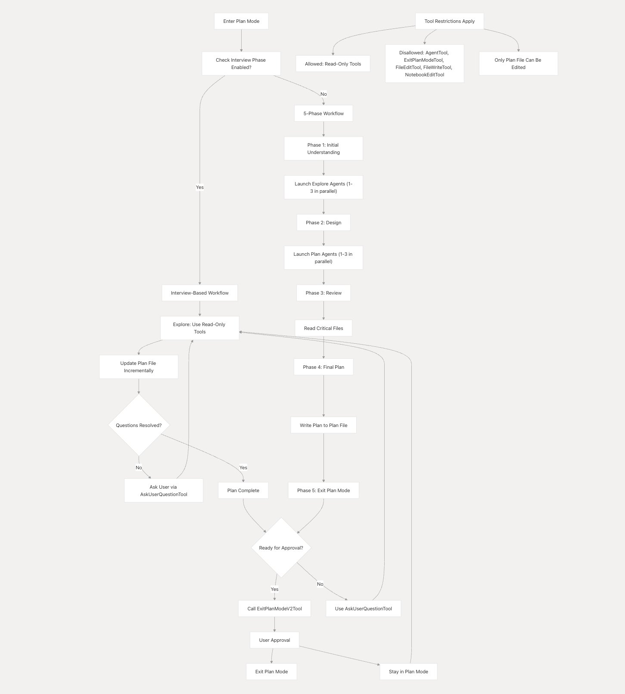

# Plan Mode — Execution Flowchart

This diagram shows the complete flow of Claude Code's Plan Mode, from entry to exit.

## Overview

Plan Mode is a restricted execution mode where Claude Code can only use read-only tools and must write its implementation plan to a single plan file before proceeding.

## Tool Restrictions

When Plan Mode is active:

| Allowed | Disallowed |
|---------|------------|
| All read-only tools (Read, Glob, Grep, etc.) | AgentTool |
| Plan file editing only | ExitPlanModeTool (until plan complete) |
| AskUserQuestionTool | FileEditTool |
| | FileWriteTool |
| | NotebookEditTool |

**Only the designated plan file can be edited** — all other write operations are blocked.

## 5-Phase Workflow

### Phase 1: Initial Understanding
- Launch 1-3 Explore agents in parallel
- Agents use read-only tools to investigate the codebase
- Focus on understanding the user's request and existing patterns

### Phase 2: Design
- Launch 1-3 Plan agents in parallel
- Agents receive exploration context from Phase 1
- Design implementation approach with different perspectives (simplicity vs. performance vs. maintainability)

### Phase 3: Review
- Read critical files identified by agents
- Verify plans align with user's original request
- Use AskUserQuestionTool to clarify remaining questions

### Phase 4: Final Plan
- Write the recommended approach to the plan file
- Include: context, file paths, reusable functions, verification steps
- One recommended approach, not all alternatives

### Phase 5: Exit Plan Mode
- If ready: Call ExitPlanModeTool → User approval
- If questions remain: Use AskUserQuestionTool first
- On approval: Exit Plan Mode → proceed to implementation
- On rejection: Stay in Plan Mode → revise plan

## Interview-Based Workflow (Alternative)

When the interview phase is enabled, Plan Mode uses an iterative approach:
1. Explore using read-only tools
2. Update plan file incrementally
3. Check if questions are resolved
4. If not: ask user via AskUserQuestionTool → loop back
5. If yes: plan complete → exit
